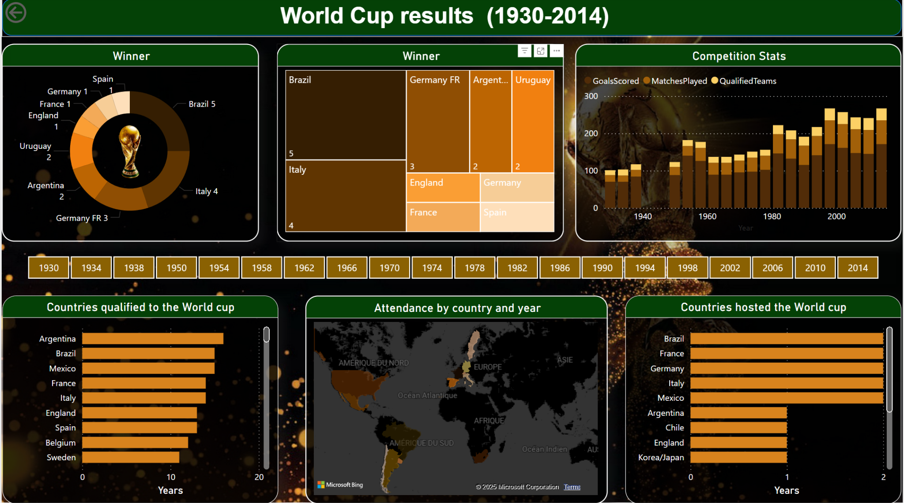

# 🏆 Power BI – FIFA World Cup Results Dashboard (1930–2014)

This Power BI dashboard presents an analytical overview of FIFA World Cup results from 1930 to 2014.  
It includes country performances, tournament stats, qualification history, and attendance insights.

## 📊 Key Features
- Winners breakdown (donut + treemap)
- Matches, goals, and qualified teams over time
- Country qualification frequency
- Host country map and stats
- Interactive slicers by year

## 📁 Project Structure

```
/pbix/                   → Power BI report file  
/data/                   → CSV datasets  
/screenshots/            → Preview of the dashboard  
```

## 🛠 Tools Used

- Power BI Desktop  
- DAX measures  
- Microsoft Bing Maps  
- Public FIFA datasets

## 📷 Dashboard Preview



---

**Author** : Sedra Claudio R.